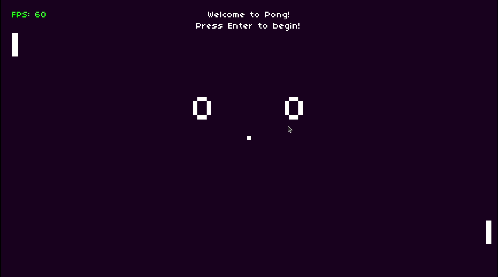

# PONG
 Originally programmed by Atari in 1972. Features two paddles, controlled by players, with the goal of getting the ball past your opponent's edge. First to 10 points wins. 

 ## Demo

 

 ------------------------------------

 This project was build beeing part of CS50 Introduction to Game Development cource 